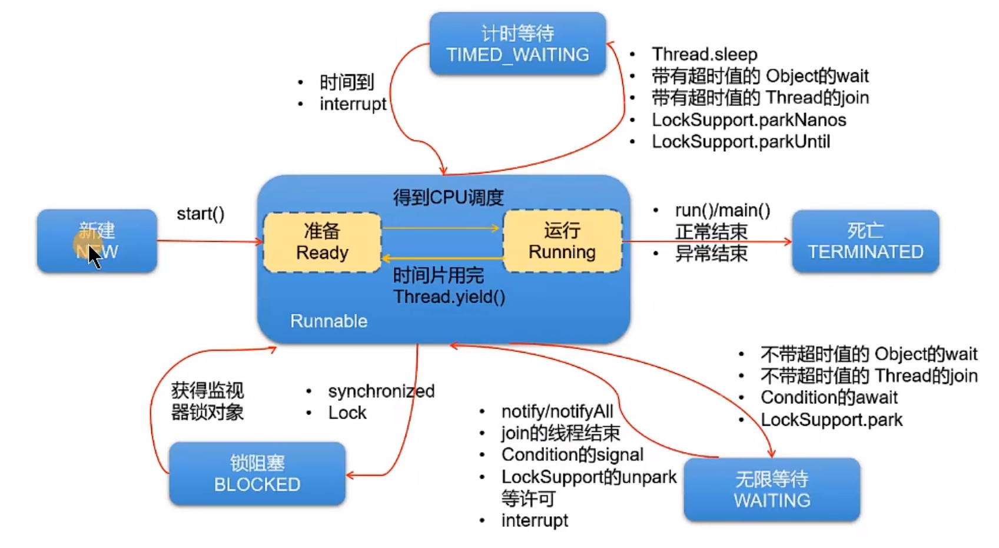

# Record Some points to remember
> Written by YZ
## 抽象类和抽象方法
1. 抽象方法所在的类，一定是抽象类（可以没有抽象方法）
```java
//i.e
public abstract class Person{
    public abstract void show();//抽象方法
}
```
此类称为抽象类；  
**抽象类不能实例化；**  
抽象类中是包含构造器的，因为子类对象实例化时，需要直接或间接的调用到父类的对象器。
2. abstract修饰方法
   1. 此方法为抽象方法
   2. 抽象方法只有方法的声明，没有方法体
   3. 抽象方法其功能是确定的（通过方法的声明即可确定）
   4. 子类必须重写父类的所有方法后，方可实例化。否则此子类仍然是一个抽象类。
3. 不能用abstract修饰私有方法，静态方法，final的方法，final的类。

## 接口
1. 定义接口的关键字：interface
2. 接口内部结构的说明
   1. 可以声明:
      1. 属性：必须使用public static final修饰
      2. 方法
   2. 不可以声明:
      1. 构造器,代码块等
```java
interface Flyable{//接口
    //全局常量
    public static final int MIN_SPEED = 0;
    int MAX_SPEED = 7900; //省略了public static final
    public abstract void show();//定义方法都是抽象方法
}
```
## 异常处理 (概念)
1. **异常**指的是程序在执行过程洪，出现的非正常情况。
2. 异常的抛出机制：
   1. 不同的异常用不同的类表示
   2. 一旦发生某种异常，就创建该异常类型的对象，并且抛出(throw).然后程序员可以捕获(catch)这个异常对象，并处理。
3. Exception
## 多线程
线程作为**CPU调度和执行的最小单位**
1. **分时调度**与**抢占式调度**
2. **并行**与**并发**
### 线程的创建
#### [方式一](ThreadTest.java)
1. 创建一个继承于Thread类的子类
2. 重写Thread类的run() --->将此线程要执行的操作，声明在此方法体中
3. 创建当前Thread的子类的对象
4. 通过对象调用start()
#### [方式二](ThreadTest.java)
1. 创建一个实现Runnable接口的类
2. 实现接口中的run() --->将此线程要执行的操作，声明在此方法体中
3. 创建当前实现类的对象
4. 将此对象作为参数传递到Thread类的构造器中，创建Thread类的实例
5. Thread类的实例调用start():
> 更适合有共享数据的情况,以及代码和数据的分离
### Thread类常用结构
#### 线程中的构造器
- public Thread() 分配一个新的线程对象
- public Thread(String name) 分配一个指定名字的新的线程对象
- public Thread(Runnable target) 指定创建线程的目标对象，它实现了Runnable接口中的run方法
- public Thread(Runnable target, String name)
#### 线程中的常用方法
- start(): 启动线程，调用线程中的run()
- run(): 将线程要执行的操作，声明在run()中
- currentThread(): 获取当前执行代码对应的线程
- getName(): 获取线程名
- setName(): 设置线程名
- sleep(long millis): 静态方法，调用时，可以使得当前线程睡眠指定的毫秒数
- yield(): 静态方法，一旦执行此方法，就释放CPU的执行权
- join(): 在线程a中通过线程b调用join()，意味着线程a进入阻塞状态，直到线程b执行结束，线程a才结束阻塞状态，继续执行
- isAlive(): 判断当前线程是否存活
#### 线程的优先级
* getPriority(): 获取线程的优先级
* Thread类内部声明的三个常量:
  * MAX_PRIORITY(10): 最高优先级
  * MIN_PRIORITY(1): 最低优先级
  * NORM_PRIORITY(5): 普通优先级，默认情况下main线程具有普通优先集。
* setPriority(): 设置线程的优先级。范围[1,10]
#### 多线程的生命周期


### [List](ListTest.java)
1. List接口中存储数据的特点: 用于存储有序的、可以重复的数据。---> 使用List替代数组，“动态”数组
2. List中的常用方法
   1. Collection声明的15个方法.
   2. 因为List是有序的，进而就有索引，进而就会增加一些针对索引操作的的方法.
      1. 插入元素: add(Object obj), addAdd(Collection coll), add(int index, Object ele), add(int index, Collection eles)
      2. 获取元素: get(int index) 
      3. 获取元索引: int indexOf(Object obj), int lastIndexOf(Object obj)
      4. 删除和替换元素: remove(Object obj), remove(int index), set(int index, Object ele)
      5. 长度: size()
      6. 遍历: iterator(): 使用迭代器进行遍历, 增强for循环，一般的for循环

### [Map](MapTest.java)
1. 主要实现类：HashMap
2. HashMap中元素的特点
   1. key用Set来存放，不允许重复,无序的 ---> key所在的类要重写hashCode()和equals()
   2. value（Collection）彼此之间是可重复的、无序的。---> value所在的类要重写equals()
   3. 一个key-value就构成了一个Entry.
   4. HashMap中的所有entry彼此之间是不可重复的、无序的。所有的entry就构成了一个Set集合
3. Map中的常用方法：
   1. 增: put(Object key, Object value), putAll(Map m)
   2. 删: remove(Object key)
   3. 改: put(Object key, Object value), putAll(Map m)
   4. 查: Object get(Object key)
   5. 长度: size()
   6. 遍历: 
      1. 遍历key集: Set keySet()
      2. 遍历value集: Collection values()
      3. 遍历entry集： Set entrySet()

### Collections工具类的使用
1. 排序
   1. reverse(List)
   2. shuffle(List)
   3. sort(List): 按升序排序
   4. sort(List, Comparator): 根据指定的Comparator 产生的顺序对List集合元素进行排序
   5. swap(List, int, int)

### 自定义泛型类/接口 和 方法
1. 泛型参数指明得需要使用包装类
```java 
   class Order<T> extends Object<T>{}
```
2. 泛型方法:
```java
public <E> E method(E e){}
```
3. 通配符?(extend: 小于等于，super: 大于等于)
   1. ?的使用(重点)
      1. 以集合为例：可以读取数据，不能写入数据(例外:null)
   2. ? extends A
      1. 以集合为例：可以读取数据，不能写入数据(例外:null)
   3. ? super A
      1. 以集合为例：可以读取数据，可以写入A类型或A类子类的数据(例外:null)
```java
List <? extends Father> list = null;
//List <? super Father> list = null;
List<Object> list1 = null;
List<Father> list2 = null;
List<Son> list3 = null;

list = list1;
list = list2;
list = list3;
```

### [File类和IO流](FileTest.java)
> File类位于java.io包下，本章中涉及的相关流也都声明在java.io包下.  
> File类的一个对象，对应与操作系统下的一个文件或一个文件目录(或文件夹)  
> File类中声明了新建、删除、获取名称、重命名等方法，并没有涉及到文件内容的读写操作。  
> 对于实现文件内容的读写，我们需要使用IO流
#### File类
1. 常用方法
   * public String[] list(): 返回一个String数组，表示该File目录中的所有子文件或目录
   * public File[] listFiles(): 返回一个File数组，表示该File目录中的所有的子文件或目录
2. 结合递归
   * [Exer_01](RecurTestFile.java): 遍历指定文件目录下的所有文件的名称，包括子文件目录中的文件
#### IO流
* IO流的分类
  * 流向的不同：输入流，输出流
  * 处理单位的不同：字节流、字符流
  * 流的角色的不同：节点流、处理流
* 流的API

| 抽象基类 | 输入流         | 输出流          |
|------|-------------|--------------|
| 字节流  | InputStream | OutputStream |
| 字符流  | Reader      | Writer       |

* 基础IO流的框架
  * 读入: read(char[] cbuffer)
  * 写出: write(String str) or write(char[] cbuffer, 0, len)

| 抽象基类         | 4个节点流（也称为[文件流](FileReaderWriterTest.java)） |
|--------------|---------------------|
| InputStream  | FileInputStream     |
| OutputStream | FIleOutputStream    |
| Reader       | FileReader          |
| Writer       | FileWriter          |
> 注意点： 写出文件的时候，如果此文件不存在，会自动创建此文件
* 对于图片jpg文件，字节文件，无法用ReaderOrWriter去读或者写
  * 因此使用[字节流]()